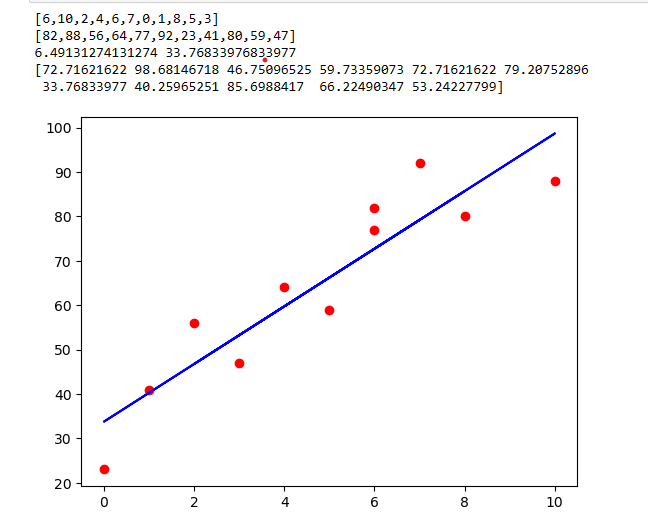

# EX01 : Implementation of Univariate Linear Regression
## Date: 
## AIM:
To implement univariate Linear Regression to fit a straight line using least squares.

## Equipments Required:
1. Hardware – PCs
2. Anaconda – Python 3.7 Installation / Jupyter notebook

## Algorithm
1. Get the independent variable X and dependent variable Y.

2. Calculate the mean of the X -values and the mean of the Y -values.
3. Find the slope m of the line of best fit using the formula. 

4. Compute the y -intercept of the line by using the formula:

5. Use the slope m and the y -intercept to form the equation of the line.
6. Obtain the straight line equation Y=mX+b and plot the scatterplot.

## Program:
```
*/Program to implement univariate Linear Regression to fit a straight line using least squares.
Developed by: VENKATANATHAN P R
RegisterNumber: 212223240173
/*

import numpy as np
import matplotlib.pyplot as plt

# Preprocessing Input data

x=np.array(eval(input("Enter the list of x:")))
y=np.array(eval(input("Enter the list of y:")))

# Mean

xmean=np.mean(x)
ymean=np.mean(y)
num=0 # for slope
den=0 # for slope

# To Find sum of (xi-x') & (yi-y') (xi-x')^2

for i in range(len(x)):
    num+=(x[i]-xmean)*(y[i]-ymean)
    den+=(x[i]-xmean)**2
    
# Calculate slope
m=num/den

# y-intercept
c=ymean-m*xmean


# Calculate intercept
b=ymean-m*xmean

# Line equation
ypred=m*x+b
print(ypred)

print("Numerator : ",num)
print("Denominator : ",den)
print("Slope / m : ",m)
print("Y-Intercept : ",c)
print("Y-Precict : ",ypred)

# To plot graph
plt.scatter(x,y,color="Red")
plt.plot(x,ypred,color="Blue")
plt.show()

```

## Output:



## Result:
Thus the univariate Linear Regression was implemented to fit a straight line using least squares using python programming.
